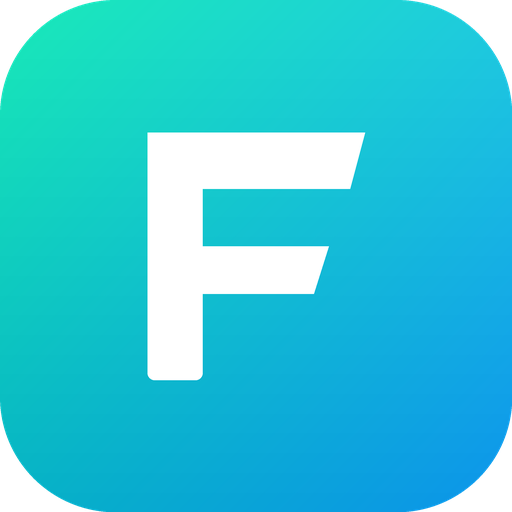
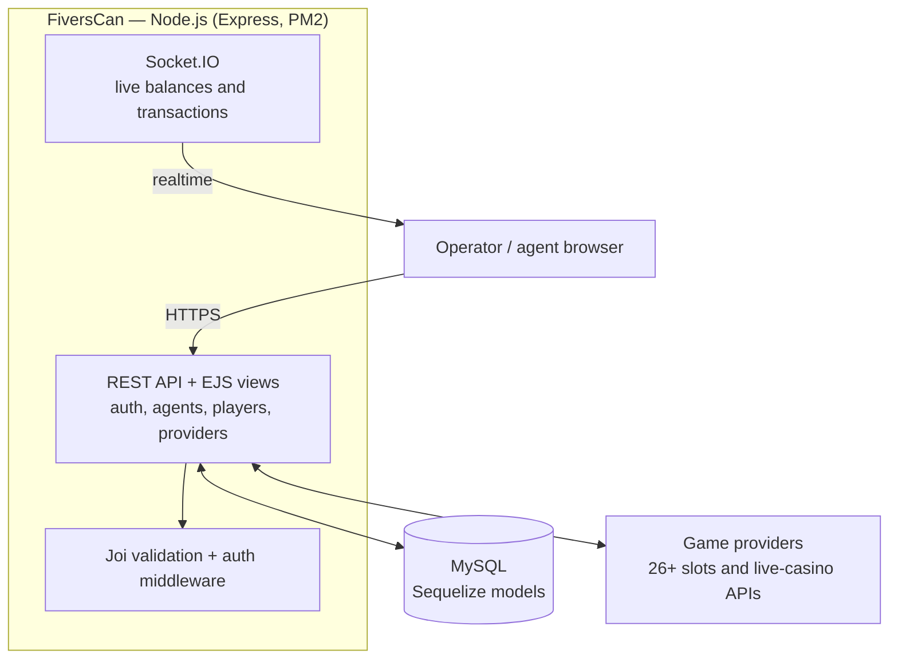

# FiversCan

[](https://github.com/ZeusbyteInc/fiverscan/actions/workflows/build.yml)
[](https://github.com/ZeusbyteInc/fiverscan/commits/main/)

[](https://nodejs.org)
[](https://expressjs.com)
[](https://mysql.com)
[](https://sequelize.org)
[](https://socket.io)
[](LICENSE)

<p align="center"></p>

**Agent panel and game-content hub for casino operations — formerly the Fiverscan/Fiverscool Panel.**

This is the official repository. FiversCan is a Node.js control panel that connects operators and agents to 26+ slots and live-casino providers: real-time balance and transaction tracking for agents and players, provider spend accounting across currencies, and a game catalog that stays synchronized with every provider's latest releases.

| | |
| --- | --- |
| **Runtime** | Node.js 16+ · Express 4 · PM2 |
| **Database** | MySQL — Sequelize ORM, schema created automatically on first start |
| **Realtime** | Socket.IO |
| **Providers** | 26+ slots and live-casino integrations |
| **Languages** | English · Korean |
| **Channel** | [t.me/goldsvet1](https://t.me/goldsvet1) |

---

## Old repository and account

> [!WARNING]
> This project was previously distributed at `github.com/zeusbyte/FiversCan` under the `github.com/zeusbyte` account. That account and its repositories are **no longer controlled or maintained by the current development team** following the departure of former team members. Treat anything originating from the old account as unofficial — this repository is the only official source.

Only the GitHub account has changed. The official Telegram channel **[t.me/goldsvet1](https://t.me/goldsvet1)** and group **[@osscasino](https://t.me/osscasino)** remain exactly as before and are unaffected by the move — anything else claiming to represent us on Telegram, including the old ~~@goldsvetcasino1~~ group, is not official.

---

## Overview

This repository contains the panel source code. The complete distribution — including provider integrations, deployment assistance, and setup on your own server — is available directly through our Telegram community.

**Repository layout**

- `index.js` — application entry point
- `loaders/` — boot sequence: database auto-creation with schema sync, Express setup
- `config/` — environment-driven configuration
- `models/` — Sequelize models: agents, players, users, providers, transactions, balances, currencies, messages, popups
- `routes/` — API and application routes
- `middlewares/` — authentication, locale, request validation
- `validations/` — Joi schemas per domain
- `utils/` — Winston logger with daily rotation, request helpers, constants
- `lang/` — localization catalogs (English, Korean)
- `public/` — panel front-end assets

---

## Tech stack

| Layer | Technology |
| --- | --- |
| Server | Node.js 16+, Express 4, EJS server-rendered views |
| Data | MySQL 5.7+ via Sequelize ORM — database and tables are created automatically on first start |
| Realtime | Socket.IO live feeds for balances and transactions |
| Security | bcryptjs password hashing, session authentication, Joi request validation, Cryptr field encryption |
| Operations | PM2 process management, Winston daily-rotating logs |

---

## Architecture



The panel authenticates operators and agents, manages players and provider integrations, and streams every balance change and transaction to the dashboard in real time. All state lives in MySQL through Sequelize models — the schema is created and maintained automatically at startup.

---

## Requirements

- Ubuntu / AlmaLinux 8 / CentOS 7
- Node.js 16 or newer
- MySQL 5.7 or newer
- PM2 (`npm install -g pm2`)
- A reverse proxy (Nginx or Apache) with SSL for production

---

## Installation

1. Clone the repository and install dependencies:

   ```bash
   npm install
   ```

2. Create your environment file from the template and fill in your database credentials:

   ```bash
   cp .env.example .env
   ```

3. Start the server — the database and all tables are created automatically on first start:

   ```bash
   npm start                        # development
   pm2 start index.js --name fiverscan   # production
   ```

4. Point your reverse proxy at the configured port (default `5006`) and enforce SSL.

---

## Support

The fastest way to get in touch is directly with the developer — for the full distribution, provider integrations, or installation on your own server:

- **Developer: [t.me/chessmate77](https://t.me/chessmate77)** — fastest response, sales, and installation
- Channel: [t.me/goldsvet1](https://t.me/goldsvet1)
- Group: [t.me/osscasino](https://t.me/osscasino)

---

## Disclaimer

This software is provided for operating licensed game-content services. Deploying and operating a gambling-related service is regulated and may be restricted or prohibited in your jurisdiction. Anyone deploying this software is solely responsible for obtaining the required licenses and complying with all applicable laws. The authors accept no liability for misuse.
